# 10 Backend Concepts Visual Field Guide

## When to Use

Use este guia quando voce precisar transformar nomes soltos de backend em um desenho operacional: quem recebe o request, qual fronteira decide, onde fica o estado, o que pode ficar velho, o que precisa ser atomico e o que acontece quando uma dependencia falha.

A pergunta central nao e "sei definir o conceito?". E "sei colocar o conceito no caminho certo do sistema sem quebrar contrato, latencia ou seguranca?".

## What Breaks First

O erro mais comum e aplicar o conceito na fronteira errada. Cache tenta esconder query sem indice, rate limit tenta resolver authorization, fila tenta corrigir transacao mal definida, CDN vaza resposta personalizada, load balancer mascara servidor degradado e CAP vira slogan para qualquer decisao de consistencia.

## Request/Data Flow

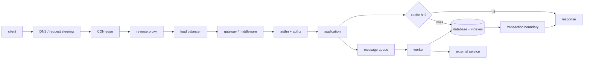

Leia o diagrama como uma cadeia de promessas:

- `CDN`, `reverse proxy` e `load balancer` protegem caminho, distancia e capacidade antes da app.
- `auth`, `rate limiting` e `authorization` decidem quem pode gastar qual recurso.
- `indexing`, `ACID/transactions` e `caching` decidem custo, integridade e frescor do estado.
- `queues` mudam tempo, retry e isolamento de efeitos.
- `CAP` aparece quando a rede particiona e a promessa distribuida precisa degradar de forma explicita.

## Concept Map

### 1. Authentication and Authorization

Authentication prova identidade. Authorization decide permissao para uma acao concreta em um recurso concreto. Token valido nao significa acesso valido.

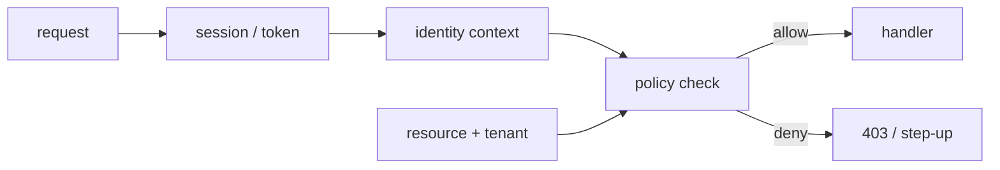

- `Request/data flow`: request carrega credencial, middleware monta identidade, policy compara identidade, tenant, recurso, acao e risco, handler recebe contexto ja validado.
- `Tradeoffs`: policy centralizada reduz drift, mas pode virar gargalo de dominio; checks locais sao rapidos, mas duplicam regra; JWT reduz lookup, mas torna revogacao e freshness mais delicadas.
- `Failure modes`: IDOR entre tenants, permissao baseada so em role global, token aceito depois de revogacao critica, step-up ausente em mutacao sensivel.
- `Interview questions`: quem pode executar esta acao? Em qual recurso? O tenant bate? Quando exigir reauth? Como auditar negacoes?
- `Backend example`: `PATCH /accounts/:id/billing` exige usuario autenticado, membership no tenant da conta, permissao `billing:write` e step-up se payment method mudou recentemente.
- `Repo links`: [Authentication and Authorization](./auth-authz.md), [Backend Security](./backend-security.md), [Chapter 07](../../../chapters/chapter-07-critical-checkout-flows-and-auth-boundaries.md), [Edge Rate Limit vs App Authorization](../../../decision-contrasts/08-edge-rate-limit-vs-app-authorization.md), [Enforce Authz, Validation and Context](../../../areas/13-backend-principle-labs/labs/enforce-authz-validation-and-context.md).

### 2. Rate Limiting

Rate limiting governa consumo antes que um cliente, tenant ou rota esgote recurso compartilhado. O limite certo nasce do dano certo, nao do algoritmo mais famoso.

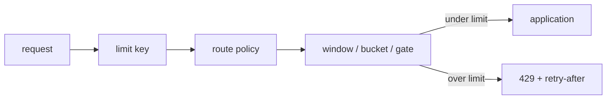

- `Request/data flow`: request vira chave de dano (`ip`, `user_id`, `tenant_id`, `api_key`, rota ou recurso), contador decide admissibilidade, app so recebe trafego admitido.
- `Tradeoffs`: `fixed window` e barato e bruto; `sliding window` melhora fairness; `token bucket` tolera burst curto; `concurrency gate` protege dependencia quando requests em voo importam mais do que taxa por minuto.
- `Failure modes`: limitar por IP e punir NAT corporativo, esquecer tenant barulhento, hot key no Redis, `fail closed` derrubar rota critica por falha do limiter, `fail open` permitir abuso em login.
- `Interview questions`: qual recurso esta sendo protegido? Qual identidade representa o dano? Burst legitimo existe? A rota falha aberta ou fechada? O problema e taxa ou concorrencia?
- `Backend example`: login usa limite por IP/device contra brute force; busca usa `user_id` ou `api_key`; export pesado usa gate por tenant para preservar workers e banco.
- `Repo links`: [Rate Limiting Algorithms and Keys](./rate-limiting-algorithms-and-keys.md), [Chapter 06](../../../chapters/chapter-06-edge-rate-limiting-waf-and-gateway-boundaries.md), [Rate Limit vs Load Shedding](../../../simulation-labs/rate-limit-vs-load-shedding.md), [Build a Ruby Rate Limiter](../../../areas/13-backend-principle-labs/labs/build-a-ruby-rate-limiter.md).

### 3. Indexing

Indexing compra caminho curto para leitura, ordenacao e unicidade. Um indice bom e uma estrutura de dados alinhada a query real; um indice ruim e custo de escrita com falsa sensacao de performance.

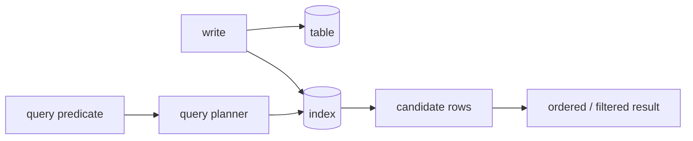

- `Request/data flow`: escrita atualiza tabela e indice; leitura passa por planner, usa seletividade/cardinalidade para escolher scan, filtra candidatos e devolve resultado na ordem pedida.
- `Tradeoffs`: indice acelera leitura e constraints, mas encarece escrita, armazenamento e migracao; indice composto ajuda uma query especifica, mas nao substitui conhecer cardinalidade e ordem dos predicados.
- `Failure modes`: query lenta por baixa seletividade, indice nao usado por funcao/cast, permission filter aplicado tarde demais, reindex competindo com producao, indice duplicado ou inutil.
- `Interview questions`: qual query precisa ficar rapida? Qual predicado e mais seletivo? A ordenacao bate com o indice? Qual custo na escrita? Como reindexar sem bloquear?
- `Backend example`: `GET /documents?q=&tenant_id=` usa indice por tenant/status/updated_at para listagem, mas busca textual com ACL e ranking pode exigir projection em search index.
- `Repo links`: [Postgres Databases](./postgres-databases.md), [Full Text Search and Elasticsearch](./full-text-search-elasticsearch.md), [Chapter 09](../../../chapters/chapter-09-search-indexing-and-permission-aware-retrieval.md), [Search Freshness / Reindex](../../../simulation-labs/search-freshness-reindex.md), [Tune Postgres Indexes and Transactions](../../../areas/13-backend-principle-labs/labs/tune-postgres-indexes-and-transactions.md).

### 4. ACID and Transactions

ACID define a promessa minima de uma mudanca atomica e consistente no banco: ou o conjunto de writes fecha com isolamento suficiente, ou nao vira estado visivel.

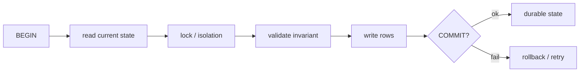

- `Request/data flow`: handler abre transacao no menor boundary necessario, le estado, valida invariantes, grava, commita; side effects externos ficam fora ou passam por outbox/idempotencia.
- `Tradeoffs`: transacao protege invariantes, mas aumenta lock time; isolamento forte reduz anomalias, mas pode diminuir throughput; transacao longa mistura estado local com dependencia externa e cria deadlock operacional.
- `Failure modes`: double spend, lost update, phantom read em regra de limite, deadlock por ordem inconsistente de locks, email/webhook disparado antes do commit e sem reconciliacao.
- `Interview questions`: qual invariante precisa ser atomica? Qual isolamento basta? O que acontece se o commit falhar? Qual efeito externo nao pode ficar dentro da transacao?
- `Backend example`: criar pedido e reservar estoque deve persistir pedido, item e reserva em uma unidade; captura de pagamento e email saem via outbox depois do commit.
- `Repo links`: [Postgres Databases](./postgres-databases.md), [Chapter 01](../../../chapters/chapter-01-relational-scaling-and-operational-discipline.md), [Chapter 03](../../../chapters/chapter-03-idempotent-writes-under-ambiguous-failure.md), [Two-Phase Commit](../../../areas/06-foundations-distribuidas/topics/two-phase-commit.md), [Deadlocks](../../../areas/06-foundations-distribuidas/topics/deadlocks.md), [Tune Postgres Indexes and Transactions](../../../areas/13-backend-principle-labs/labs/tune-postgres-indexes-and-transactions.md).

### 5. Caching

Caching guarda uma resposta ou dado derivado porque recomputar ou reler toda vez custa demais. Cache bom tem contrato de frescor; cache ruim so adia a conversa sobre origem.

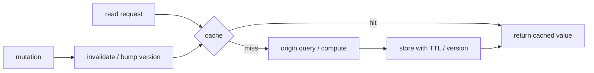

- `Request/data flow`: leitura busca cache por chave, miss consulta origem, app popula com TTL/versionamento; mutacao invalida, atualiza versao ou aceita staleness medida.
- `Tradeoffs`: cache reduz latencia e carga, mas introduz stale, hot keys, stampede e invalidacao; TTL simples e barato, invalidacao precisa e mais correta, versionamento e melhor para objetos imutaveis.
- `Failure modes`: stale em fluxo sensivel, cache key sem tenant vazando dados, miss storm depois de purge, negative caching ausente, Redis como novo SPOF de latencia.
- `Interview questions`: o que pode ficar velho? Por quanto tempo? Quem invalida? O que acontece no miss? O cache pode falhar aberto? Qual metrica desliga a estrategia?
- `Backend example`: dashboard multi-tenant usa cache por `tenant_id + filters`, TTL curto e invalidacao por evento de escrita; dados de billing sensiveis usam leitura direta ou cache privado com cuidado.
- `Repo links`: [Caching](./caching.md), [Chapter 01](../../../chapters/chapter-01-relational-scaling-and-operational-discipline.md), [Chapter 10](../../../chapters/chapter-10-cdn-placement-dns-and-cache-invalidation.md), [Cache](../../../simulation-labs/cache.md), [CDN Cache vs App Cache](../../../decision-contrasts/09-cdn-cache-vs-app-cache.md), [Cache Hot Key and Origin Protection](../../../areas/11-operational-playbooks/playbooks/cache-hot-key-and-origin-protection.md).

### 6. Message Queues

Queues desacoplam tempo e capacidade: o request publica trabalho duravel ou retryable, e workers processam fora do caminho sincrono. Fila nao torna efeito correto so por existir.

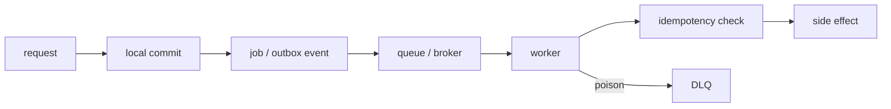

- `Request/data flow`: request grava estado local e job/outbox, broker entrega para worker, worker aplica dedupe, executa efeito, ack/nack e envia mensagens ruins para DLQ.
- `Tradeoffs`: fila reduz latencia do request e absorve burst, mas cria eventual consistency, lag, duplicidade e mais superficie de observabilidade; ordering por chave pode reduzir paralelismo.
- `Failure modes`: retry duplicar pagamento/email, poison message travar particao, DLQ ignorada, payload grande ou com dado sensivel, replay competir com trafego ao vivo.
- `Interview questions`: o efeito e idempotente? Qual chave de dedupe? Qual politica de retry? Qual max age aceitavel? Como drenar DLQ? Onde fica o source of truth?
- `Backend example`: compra confirmada gera job `SendReceiptEmail` com `order_id`; worker busca estado atual, deduplica por evento e faz retry exponencial sem duplicar email.
- `Repo links`: [Task Queues and Background Jobs](./task-queues-background-jobs.md), [Message Queue](../../../areas/07-componentes-de-sistemas/cards/message-queue.md), [Chapter 04](../../../chapters/chapter-04-event-backbone-partitions-and-consumer-scale.md), [Queue Replay / Idempotency](../../../simulation-labs/queue-replay-idempotency.md), [Queue Lag, DLQ and Replay](../../../areas/11-operational-playbooks/playbooks/queue-lag-dlq-and-replay.md), [Design Cache, Jobs and Webhooks](../../../areas/13-backend-principle-labs/labs/design-cache-jobs-and-webhooks.md).

### 7. Load Balancing

Load balancing escolhe para qual upstream enviar trabalho. A decisao deve proteger latencia, erro e blast radius, nao apenas dividir requests igualmente.

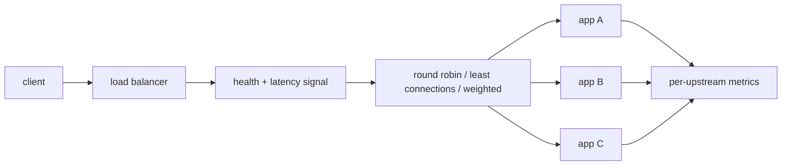

- `Request/data flow`: LB recebe conexao, consulta health/weights, escolhe upstream, registra latencia/erro por alvo e remove ou reduz peso de instancias degradadas.
- `Tradeoffs`: round robin e simples; least connections reage a lentidao; weighted ajuda rollout/capacidade desigual; sticky sessions simplificam estado local, mas reduzem flexibilidade e mascaram imbalance.
- `Failure modes`: health check raso demais, servidor lento ainda saudavel, retry storm para todos os upstreams, sticky session prendendo usuario em nodo ruim, fila interna invisivel no target.
- `Interview questions`: qual sinal tira um servidor do pool? O algoritmo enxerga latencia ou so contagem? Como limitar retries? Como fazer canary? O app e stateless?
- `Backend example`: API Rails com Puma heterogeneo usa LB por least outstanding requests, timeout curto, passive health em 5xx/latencia e canary com peso baixo.
- `Repo links`: [Scaling and Performance](./scaling-performance.md), [Load Balancer](../../../simulation-labs/load-balancer.md), [Chapter 06](../../../chapters/chapter-06-edge-rate-limiting-waf-and-gateway-boundaries.md), [Cloudflare - Edge Platform](../../../real-world-cases/04-edge-and-delivery/cloudflare-edge-platform/README.md).

### 8. CAP Theorem

CAP e uma lente para comportamento sob particao de rede. Quando os lados nao conseguem conversar, o sistema precisa escolher entre continuar aceitando operacoes possivelmente divergentes ou preservar uma visao consistente recusando/atrasando parte do trabalho.

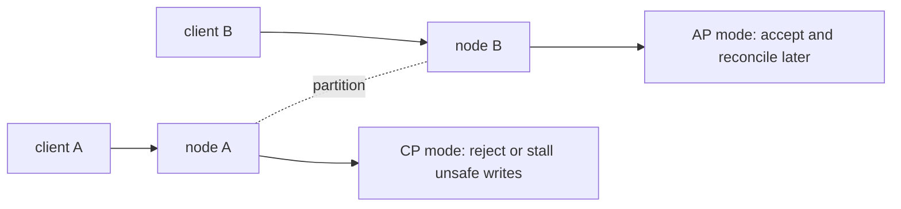

- `Request/data flow`: clientes chegam em lados diferentes da particao; quorum/consensus pode recusar writes sem maioria; sistema AP pode aceitar localmente e resolver conflito depois.
- `Tradeoffs`: CP protege invariantes fortes, mas sacrifica disponibilidade parcial; AP preserva writes/leitura local, mas cobra reconciliacao e semantica de conflito; muitos sistemas reais escolhem por operacao.
- `Failure modes`: usar CAP para justificar cache stale comum, aceitar escrita divergente sem merge strategy, parar leitura que poderia ser segura, confundir latencia alta com particao formal.
- `Interview questions`: qual operacao precisa de consenso? O que pode aceitar conflito? Qual erro o usuario ve durante particao? Como reconciliar? Qual metrica detecta split-brain?
- `Backend example`: ledger de saldo prefere recusar transferencia sem quorum; contador de curtidas pode aceitar incremento local e reconciliar; carrinho pode ficar disponivel com conflito resolvivel.
- `Repo links`: [CAP Theorem](../../../areas/06-foundations-distribuidas/topics/cap-theorem.md), [Network Partitions](../../../areas/06-foundations-distribuidas/topics/network-partitions.md), [Consensus](../../../areas/06-foundations-distribuidas/topics/consensus.md), [Chapter 04](../../../chapters/chapter-04-event-backbone-partitions-and-consumer-scale.md), [Disaster Recovery / Failover Drill](../../../simulation-labs/disaster-recovery-failover-drill.md).

### 9. Reverse Proxy

Reverse proxy fica na frente dos servidores de aplicacao para terminar TLS, normalizar headers, rotear paths, servir estatico, aplicar compressao e isolar upstreams. Ele nao conhece regra de dominio por padrao.

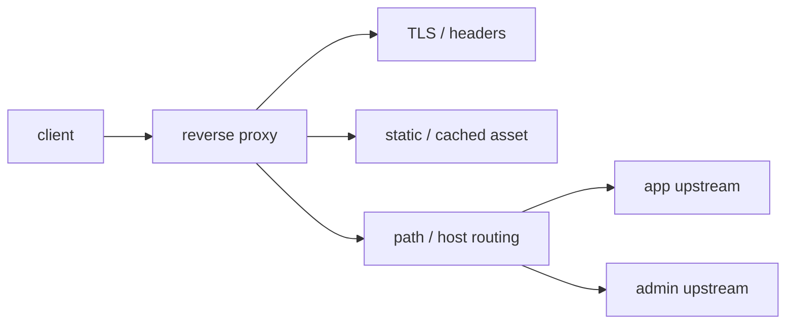

- `Request/data flow`: cliente fala com proxy, proxy trata conexao e headers confiaveis, decide upstream por host/path e encaminha request com timeouts e limites.
- `Tradeoffs`: centraliza borda HTTP e reduz exposicao da app, mas cria camada que pode esconder IP real, timeouts, body size e headers perigosos; configuracao duplicada entre proxy e app vira drift.
- `Failure modes`: confiar em `X-Forwarded-For` sem whitelist, timeout maior no proxy que na app, buffer grande demais para upload, roteamento errado expondo admin, rewrite quebrando assinatura de webhook.
- `Interview questions`: quais headers sao confiaveis? Quem termina TLS? Qual body size maximo? O proxy faz auth ou so encaminha contexto? Como observar upstream por rota?
- `Backend example`: Nginx/Caddy/Envoy termina TLS, redireciona HTTP para HTTPS, serve assets fingerprintados, limita upload, passa `X-Request-ID` e roteia `/admin` para pool separado.
- `Repo links`: [Reverse Proxy](../../../areas/07-componentes-de-sistemas/cards/reverse-proxy.md), [API Gateway](../../../areas/07-componentes-de-sistemas/cards/api-gateway.md), [Firewall/WAF](../../../areas/07-componentes-de-sistemas/cards/firewall-waf.md), [Chapter 06](../../../chapters/chapter-06-edge-rate-limiting-waf-and-gateway-boundaries.md).

### 10. CDN

CDN coloca objetos cacheaveis perto do usuario e protege a origem contra repeticao global. O design real combina placement, cache key, TTL, invalidacao e fallback de origem.

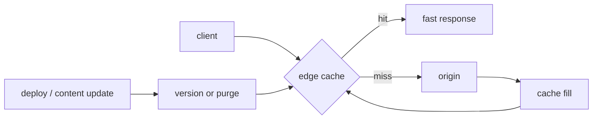

- `Request/data flow`: request chega no edge, cache key decide hit/miss, miss busca origem, resposta volta com headers de cache, update usa versionamento ou purge cirurgico.
- `Tradeoffs`: CDN reduz latencia e custo de origem, mas torna freshness, variacao por usuario e invalidacao mais perigosas; assets imutaveis preferem fingerprint/TTL longo, conteudo mutavel prefere TTL curto ou stale strategy.
- `Failure modes`: cache publico de resposta personalizada, `purge all` criando miss storm, TTL unico para browser e edge, `Vary` mal definido matando hit ratio, origem sem protecao no fill.
- `Interview questions`: este objeto e realmente compartilhavel? Browser e edge precisam do mesmo TTL? Versionamento basta? Como proteger origin shield? O que acontece se purge falhar?
- `Backend example`: imagens publicas e assets fingerprintados vivem dias no edge; JSON publico de catalogo usa TTL curto e `stale-while-revalidate`; resposta com sessao usa `Cache-Control: private, no-store`.
- `Repo links`: [CDN](../../../areas/07-componentes-de-sistemas/cards/cdn.md), [Chapter 10](../../../chapters/chapter-10-cdn-placement-dns-and-cache-invalidation.md), [CDN Cache vs App Cache](../../../decision-contrasts/09-cdn-cache-vs-app-cache.md), [Cache](../../../simulation-labs/cache.md), [Netflix - Open Connect CDN](../../../real-world-cases/04-edge-and-delivery/netflix-open-connect-cdn/README.md).

## Interview Trap

Responder com produtos em vez de contratos:

- "JWT resolve auth" ignora authorization.
- "Redis resolve cache" ignora freshness.
- "Kafka resolve fila" ignora idempotencia e replay.
- "CDN deixa rapido" ignora cache key, invalidacao e origem.
- "CAP escolhe dois" ignora que a pergunta so aparece sob particao.

A resposta senior sempre volta para boundary, promessa, falha e metrica.

## Practice Drill

Use [Map a Backend Request Path](../../../areas/13-backend-principle-labs/labs/map-a-backend-request-path.md) para transformar este guia em treino ativo. Escolha uma rota real, desenhe o caminho completo, marque os 10 conceitos, injete uma falha por conceito e explique qual metrica provaria que o design sobreviveu.

## Source Anchor

- [10 Backend Concepts Every Developer Must Know](https://javascript.plainenglish.io/10-backend-concepts-every-developer-must-know-7c4fcf5a19fa) foi usado como lista de topicos, nao como texto-base copiado.
- Ponte interna: [Backend Roadmap](./backend-roadmap.md), [Backend Principle Labs](../../../areas/13-backend-principle-labs/README.md), [Simulation Labs](../../../simulation-labs/README.md).
