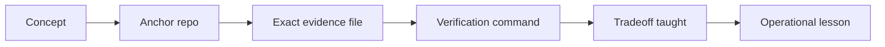

# Backend Portfolio Evidence Map

## When to Use

Quando voce quer sair do estudo abstrato e provar um conceito com evidencia de portfolio: repo certo, arquivo certo e comando certo.

## What Breaks First

O estudo vira lista de buzzwords. A pessoa sabe falar "idempotencia", "DLQ" ou "tenant isolation", mas nao consegue abrir um repo proprio e mostrar onde isso aparece de verdade.

## Design Moves

Trate cada conceito como um caminho de prova curto: nomeie o melhor projeto ancora, linke um arquivo exato, execute um comando pequeno, explique o trade-off e feche com a licao operacional que voce levaria para review, entrevista ou incidente.

## Interview Trap

Responder com arquitetura generica sem evidencias. Portfolio forte nao e so "tenho um projeto com isso"; e "aqui esta o arquivo, aqui esta o teste, aqui esta a decisao".

## Practice Drill

Faca 3 passes:

1. pegue 1 conceito de `request boundary`, 1 de `consistency spine` e 1 de `runtime and delivery`;
2. abra o arquivo exato e rode o comando;
3. diga em voz alta: que risco esta sendo controlado, o que quebra primeiro e qual alternativa foi rejeitada;
4. so depois compare com um exemplo `em construcao`, quando a autoridade atual trouxer esse contraste.

## Trust Legend

Autoridade usada neste card:
- [release-readiness-dashboard.md](../../../../.agents/eval-reports/release-readiness-dashboard.md)
- [publication-baseline-2026-06-29.md](../../../../.agents/eval-reports/publication-baseline-2026-06-29.md)
- [full-program-readiness-2026-06-29.json](../../../../.agents/eval-reports/full-program-readiness-2026-06-29.json) como base de readiness quando o dashboard nao precisa sobrescrever deltas

Como ler o status:

- `Trusted first`: repo aparece como `ready, public` na autoridade viva atual. E a ancora primaria para estudo, review e portfolio walkthrough.
- `Em construcao`: use so como contraste quando um delta futuro tirar o repo da trilha `ready/public`.

## How to Read This Map

Nao leia em ordem alfabetica. Leia em ordem de sistema:

1. `request boundary`: quem entra, com qual chave, com qual tenant, com qual replay protection;
2. `consistency spine`: onde ficam verdade, transacao, fila, cache e ledger;
3. `runtime and delivery`: como provar health, retry, replay, deploy e CI.
4. `operational lesson`: a decisao de operacao, review ou incidente que esse artefato te obriga a defender.

## Pass 1 - Request Boundary

| Concept | Project | Exact evidence file | Verification command | Trust status | Tradeoff taught | Operational lesson |
| --- | --- | --- | --- | --- | --- | --- |
| Auth | [SettleFlow Rails Financial Core](../../../../settleflow-rails-financial-core/README.md) | [docs/adr/0003-api-key-idempotency.md](../../../../settleflow-rails-financial-core/docs/adr/0003-api-key-idempotency.md) | `cd ../settleflow-rails-financial-core && bin/rails test test/requests/v1_authorization_matrix_test.rb test/requests/idempotency_test.rb` | Trusted first. `ready: yes`, `public: yes`. | API key com escopo e idempotency key simplifica server-to-server fintech APIs, mas o produto passa a ser dono de rotacao, escopos e auditoria de credenciais. | Mostre primeiro a matriz de autorizacao e o caminho de revogacao; falar em auth sem operacao de chave ainda e teoria. |
| Idempotency | [SettleFlow Rails Financial Core](../../../../settleflow-rails-financial-core/README.md) | [test/requests/idempotency_test.rb](../../../../settleflow-rails-financial-core/test/requests/idempotency_test.rb) | `cd ../settleflow-rails-financial-core && bin/rails test test/requests/idempotency_test.rb` | Trusted first. `ready: yes`, `public: yes`. | Idempotencia so funciona de verdade quando metodo, path, query e request hash entram na identidade do comando; middleware sozinho nao protege debito duplicado. | Em revisao de pagamento, valide a identidade completa do comando antes de discutir UX de retry ou timeout. |
| Rate limits | [FerrisLedger Rust Financial Runtime](../../../../ferrisledger-rust-financial-runtime/README.md) | [docs/security/authorization-matrix.md](../../../../ferrisledger-rust-financial-runtime/docs/security/authorization-matrix.md) | `cd ../ferrisledger-rust-financial-runtime && cargo test --workspace --all-targets` | Trusted first. `ready: yes`, `public: yes`. | Rate limit de trafego autenticado e limite de falha de auth precisam ser separados; misturar tudo vira ruido operacional e mascara abuso real. | Separe limite de abuso de limite de negocio; alerta agregado demais atrasa a resposta certa. |
| Tenant isolation | [SettleFlow Rails Financial Core](../../../../settleflow-rails-financial-core/README.md) | [test/requests/v1_authorization_matrix_test.rb](../../../../settleflow-rails-financial-core/test/requests/v1_authorization_matrix_test.rb) | `cd ../settleflow-rails-financial-core && bin/rails test test/requests/v1_authorization_matrix_test.rb test/requests/ops_authorization_matrix_test.rb` | Trusted first. `ready: yes`, `public: yes`. | Isolamento real atravessa API publica, console ops e auditoria; schema multi-tenant sem matriz de permissao ainda deixa vazamento pelo caminho humano. | Sempre teste tenant errado no endpoint normal e no caminho de ops; o vazamento costuma entrar pela excecao humana. |

## Pass 2 - Consistency Spine

| Concept | Project | Exact evidence file | Verification command | Trust status | Tradeoff taught | Operational lesson |
| --- | --- | --- | --- | --- | --- | --- |
| Transactions | [SettleFlow Rails Financial Core](../../../../settleflow-rails-financial-core/README.md) | [docs/database/transaction-boundaries.md](../../../../settleflow-rails-financial-core/docs/database/transaction-boundaries.md) | `cd ../settleflow-rails-financial-core && bin/rails test test/services/database_consistency_verifier_test.rb` | Trusted first. `ready: yes`, `public: yes`. | Ledger, projection, idempotency e outbox precisam comitar juntos; publicacao, analytics e cache ficam para depois do commit. | Desenhe o que precisa comitar junto e o que pode sair por outbox; esse corte decide a consistencia real. |
| Queues | [SettleFlow Rails Financial Core](../../../../settleflow-rails-financial-core/README.md) | [docs/events/messaging.md](../../../../settleflow-rails-financial-core/docs/events/messaging.md) | `cd ../settleflow-rails-financial-core && bin/rails test test/jobs/outbox_publish_job_test.rb test/jobs/outbox_sweep_job_test.rb test/services/outbox_event_contract_test.rb` | Trusted first. `ready: yes`, `public: yes`. | Outbox transacional com jobs locais segura consistencia cedo; broker-first so compensa quando throughput, fanout ou integracoes pedem mais que isso. | Antes de pedir broker novo, prove backlog, retry e erro com a fila local; a simplicidade some rapido depois. |
| Caching | [SettleFlow Rails Financial Core](../../../../settleflow-rails-financial-core/README.md) | [docs/database/redis-usage.md](../../../../settleflow-rails-financial-core/docs/database/redis-usage.md) | `cd ../settleflow-rails-financial-core && REDIS_URL=redis://localhost:6379/0 bin/rails redis:verify` | Trusted first. `ready: yes`, `public: yes`. | Cache e lock temporario ajudam operacao, mas saldo, reconciliacao e idempotencia continuam no sistema de verdade; perder Redis nao pode corromper dinheiro. | Planeje a perda de cache como evento normal; se o sistema nao fecha sem Redis, ele nao era cache. |
| Ledgers | [SettleFlow Rails Financial Core](../../../../settleflow-rails-financial-core/README.md) | [docs/adr/0001-double-entry-ledger.md](../../../../settleflow-rails-financial-core/docs/adr/0001-double-entry-ledger.md) | `cd ../settleflow-rails-financial-core && bin/rails test test/services/database_consistency_verifier_test.rb test/services/ledger_journal_poster_test.rb` | Trusted first. `ready: yes`, `public: yes`. | Ledger de dupla entrada encarece o modelo, mas transforma saldo em evidencia explicavel em vez de numero mutavel sem trilha contabil. | Em incidente financeiro, exija journal reproduzivel antes de aceitar qualquer saldo agregado como verdade. |
| Event sourcing | [FerrisLedger Rust Financial Runtime](../../../../ferrisledger-rust-financial-runtime/README.md) | [docs/architecture/data-consistency.md](../../../../ferrisledger-rust-financial-runtime/docs/architecture/data-consistency.md) | `cd ../ferrisledger-rust-financial-runtime && cargo test --workspace --all-targets` | Trusted first. `ready: yes`, `public: yes`. | Replay como verdade primaria ajuda auditoria e rebuild, mas puxa para dentro do produto a complexidade de versionamento, snapshot e storage append-only. | Use replay para explicar auditoria e rebuild, mas cobre versionamento e snapshot na mesma resposta. |
| CAP | [System Design Estudos](../../../README.md) | [areas/06-foundations-distribuidas/topics/cap-theorem.md](../../06-foundations-distribuidas/topics/cap-theorem.md) | `bundle exec rake check` | Trusted first. `ready: yes`, `public: yes`. | Particao nao e detalhe de infraestrutura; e o limite que obriga escolher onde voce aceita indisponibilidade e onde voce aceita coordenacao fraca. | Sempre nomeie qual operacao aceita stale read ou indisponibilidade durante particao; slogan sem corte concreto nao convence. |

## Pass 3 - Runtime and Delivery

| Concept | Project | Exact evidence file | Verification command | Trust status | Tradeoff taught | Operational lesson |
| --- | --- | --- | --- | --- | --- | --- |
| Observability | [TraceBridge Go Observability Pipeline](../../../../tracebridge-go-observability-pipeline/README.md) | [internal/app/app_test.go](../../../../tracebridge-go-observability-pipeline/internal/app/app_test.go) | `cd ../tracebridge-go-observability-pipeline && go test ./internal/app -run TestAppOperationalSurfaceReflectsPipelineState -count=1` | Trusted first. `ready: yes`, `public: yes`. | O pipeline de observabilidade tambem precisa ser observavel; health, readiness, metrics e accepted/exported counts sao parte do produto, nao detalhe lateral. | Health sem contadores de accepted/exported nao ajuda on-call; monitore o pipeline como produto. |
| Retries | [TraceBridge Go Observability Pipeline](../../../../tracebridge-go-observability-pipeline/README.md) | [internal/pipeline/retry_test.go](../../../../tracebridge-go-observability-pipeline/internal/pipeline/retry_test.go) | `cd ../tracebridge-go-observability-pipeline && go test ./internal/pipeline -run TestRetryPolicy -count=1` | Trusted first. `ready: yes`, `public: yes`. | Retry sem classificacao de erro e backoff capped so converte outage temporario em tempestade repetida. | Revise classificacao de erro, backoff e budget de tentativa juntos; retry infinito so esconde o outage. |
| DLQ | [TraceBridge Go Observability Pipeline](../../../../tracebridge-go-observability-pipeline/README.md) | [docs/runbooks/dlq-spike.md](../../../../tracebridge-go-observability-pipeline/docs/runbooks/dlq-spike.md) | `cd ../tracebridge-go-observability-pipeline && go test ./internal/httpapi -run 'TestReplay(MetricsTrackAcceptedAndSkippedEntries|OmitsOtherTenantEntriesWhenAuthenticatedTenantIsScoped|RejectsTenantMismatchForAPIKey)' -count=1` | Trusted first. `ready: yes`, `public: yes`. | DLQ preserva evidencia e reduz blast radius, mas cobra triagem humana antes de qualquer replay em lote. | Fila morta so presta com criterio de triagem e dono do replay; sem isso ela vira cemiterio silencioso. |
| Replay | [TraceBridge Go Observability Pipeline](../../../../tracebridge-go-observability-pipeline/README.md) | [internal/httpapi/api_test.go](../../../../tracebridge-go-observability-pipeline/internal/httpapi/api_test.go) | `cd ../tracebridge-go-observability-pipeline && go test ./internal/httpapi -run 'TestReplay(MetricsTrackAcceptedAndSkippedEntries|OmitsOtherTenantEntriesWhenAuthenticatedTenantIsScoped|RejectsTenantMismatchForAPIKey)' -count=1` | Trusted first. `ready: yes`, `public: yes`. | Replay seguro e fluxo de operacao com escopo de tenant e lote pequeno; nao e botao magico para "processar tudo de novo". | Replay seguro e pequeno, com tenant escopado e medicao; nunca trate replay como rollback magico. |
| Railway | [TraceBridge Go Observability Pipeline](../../../../tracebridge-go-observability-pipeline/README.md) | [docs/deployment/railway.md](../../../../tracebridge-go-observability-pipeline/docs/deployment/railway.md) | `cd ../tracebridge-go-observability-pipeline && go test ./internal/config -run 'TestLoad(UsesRailwayPortWhenTracebridgeAddrIsUnset|PrefersTracebridgeAddrOverPort)' -count=1` | Trusted first. `ready: yes`, `public: yes`. | Railway acelera demo e smoke deploy, mas memory buffer e DLQ local ainda sao topologia de review, nao topologia final de producao. | Explique o que Railway acelera hoje e o que ainda e provisorio; deploy facil nao substitui topologia final. |
| CI/CD | [Active Record Optimizer](../../../../active_record_optimizer/README.md) | [.github/workflows/ci.yml](../../../../active_record_optimizer/.github/workflows/ci.yml) | `cd ../active_record_optimizer && bundle exec rake verify` | Trusted first. `ready: yes`, `public: yes`. | CI forte prova contrato publicado, empacotamento e integracao real; nao basta rodar unit test solto no host do autor. | Leia o workflow como contrato publico: lint, test, package e verify precisam falhar antes do usuario descobrir. |
| Kubernetes | [KubePulse Go Operator](../../../../kubepulse-go-operator/README.md) | [internal/controller/goservice_controller_test.go](../../../../kubepulse-go-operator/internal/controller/goservice_controller_test.go) | `cd ../kubepulse-go-operator && go test ./internal/controller -count=1` | Trusted first. `ready: yes`, `public: yes`. | Reconciliacao com status conditions custa mais que Helm ou manifestos estaticos, mas compra drift repair, idempotencia e feedback de rollout. | Status conditions e reconcile loop sao a prova; manifesto bonito sem drift repair nao sustenta operador. |

## Advanced Security Control Plane

Use esta linha depois de dominar as ancoras `trusted first` do request boundary
e do runtime.

| Concept | Project | Exact evidence file | Verification command | Trust status | Tradeoff taught | Operational lesson |
| --- | --- | --- | --- | --- | --- | --- |
| Auth control plane | [TrustVault Go Security Control Plane](../../../../trustvault-go-security-control-plane/README.md) | [docs/security/authorization-matrix.md](../../../../trustvault-go-security-control-plane/docs/security/authorization-matrix.md) | `cd ../trustvault-go-security-control-plane && make verify` | Trusted first. `ready: yes`, `public: yes`. | Tirar credenciais, secret rotation e break-glass de cada servico reduz drift de seguranca, mas cria um novo plano de controle que tambem precisa alta disciplina operacional. | Centralizar segredo reduz drift, mas exige runbooks de rotacao e break-glass tao fortes quanto os apps que ele protege. |

## Source Anchor

- [Architecture Decision Records](https://adr.github.io/).
- [Google SRE Workbook](https://sre.google/workbook/).
- [AWS Well-Architected Framework](https://docs.aws.amazon.com/wellarchitected/latest/framework/welcome.html).
